  

## 📌 About Me
- A full-stack developer expertise in Agile methodologies, proficient in JavaScript, TypeScript, ReactJS, and the MERN stack. Specializing in responsive web design and debugging, I excel in both front-end and back-end development, ensuring clean code and optimal performance throughout the software development lifecycle. My experience includes building scalable apps, integrating APIs, implementing secure payment integration with careful attention to detail.

## 🧠 My Focus Areas
- Full Stack Development
- MERN Stack Development
- Frontend Engineering
- Web Application Development
- React.js Development
- Node.js Development
- API Development & Integration
- JavaScript / TypeScript Development
- Scalable Application Development
- Performance Optimization
- UI Engineering
- Component Architecture
- Responsive Web Development
- Database Design (MongoDB / SQL)
- Software Engineering

## 📊 GitHub Stats & Trophies

  
  

  

  

  

## 🛠️ Languages & Tools

<h3 align="center">Programming Languages</h3>

  &nbsp;
  

<h3 align="center">Frontend</h3>

  &nbsp;
  &nbsp;
  &nbsp;
  &nbsp;
  &nbsp;
  

<h3 align="center">Backend</h3>

  &nbsp;
  

<h3 align="center">Database</h3>

  &nbsp;
  &nbsp;
  

<h3 align="center">DevOps & Cloud</h3>

  &nbsp;
  

<h3 align="center">Tools</h3>

  &nbsp;
  &nbsp;
  &nbsp;
  &nbsp;
  

  

 

## 🔗 Connect with Me

  &nbsp;&nbsp;&nbsp;&nbsp;&nbsp;&nbsp;
  

  

